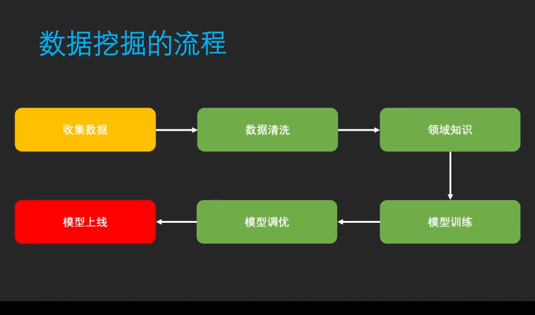

# 人工智能绪论

## 一、典型的数据挖掘问题

+ 拟合：Regression
+ 分类：Classification
+ 聚类：Clustering
+ 异常检测：Anomaly Detection

### 1.拟合

拟合就是根据数据点画出一条线。

### 2.分类

在特征空间中，使用超平面将数据分类开。

在有监督学习中，我们事先给出了数据的分类标准。

### 3.聚类

在聚类分析中，我们不告诉数据的分类，让机器更具数据的特征来分类，这就是无监督学习。

聚类的方法也可以用来进行异常检测。

### 4.异常检测

## 二、数据挖掘的流程

(名词补充：Object Detection，需要深度学习辅助)

在传统机器学习中，需要进行特征提取，但是在深度神经网络中可以直接从原始数据得到最终的结果，这就是直接端到端的处理，为了达到这个效果，需要在数据清洗之后将领域知识加载到程序中。

### 1.模型训练

+ 训练集：用来优化模型参数
+ 验证集：用来在模型训练过程中调节模型
+ 测试集：对模型进行最终的评估

### 2.模型调优

首先确认训练数据是没有问题的。

+ 训练误差大：更大的训练模型，更长的训练时间，新的模型结构等
+ 验证误差大：更多的数据，正则化，新的模型结构
+ 测试误差大：更多的数据

### 3.常见的问题

1. 数据量不够：

   +  尝试收集更多的数据
   + 使用数据放大的方法合成新的数据
   + 学会自己合成数据，通过加入噪声的方法在原有的数据中加入噪声，不要加入线性的随机噪声，因为多数模型对线性噪声具有抵抗能力。

2. 不知道选择什么模型

   + 明确问题类型

     分析问题是拟合、分类还是聚类，明确之后选择模型。

   + 使用前人经验

   + 尝试最新技术，如深度学习。

3. 深度学习不能做什么

   人类思考时间大于1s的事情，仅靠目前的深度学习技术无法解决。

## 三、数据的诅咒

+ 统计的前提—样本要足够多

  大数定律，样本数量很大的时候，样本均值和真实均值充分接近。

+ 平均数与中位数

  平均数往往具有欺骗新，柱状图最靠谱

+ 关联与因果关系

  关联不等于因果关系，很多时候不知道为什么，在研究中更应当从关联去研究。